# 안녕하세요, 김관영입니다 👋

사용자 입력 → 서버 데이터 → 화면 상태로 이어지는 흐름을 만드는 신입 개발자입니다.
React/TypeScript/Vite로 화면을 만들고, Spring Boot/MySQL로 API를 연동하는 작업을 주로 해왔습니다.

- 🌐 포트폴리오: [ketose.vercel.app](https://ketose.vercel.app)
- 🎓 백석대학교 소프트웨어학전공 · K-Digital Training (2024.11 ~ 2025.07)

## Stack

Git/GitHub, Figma, Notion으로 협업하고, REST API·WebSocket 기반 데이터 흐름과 상태 관리(Zustand)를 주로 다룹니다.

## GitHub Stats

## Projects

<!-- PORTFOLIO:PROJECTS:START -->
| 프로젝트 | 기간 | 설명 |
| --- | --- | --- |
| [하자체크](https://github.com/luma-team-ai/HajaCheck) | 2026.07.09 ~ 2026.08.07 (4주) | AI 시설물 하자 탐지와 근거 기반 점검 보고서 생성 서비스 |
| [HyperFrame](https://github.com/Ketose333/HyperFrame) | 2026.07.01 ~ 현재 (진행 중) | 드로잉 웨이브테이블 신스 VST3 플러그인 |
| [music-mood-recs](https://github.com/Ketose333/music-mood-recs) | 2026.06.25 ~ 2026.07.04 (9일) | CNN 무드 분류와 임베딩 추천을 결합한 Streamlit 앱 |
| [review-sentiment](https://github.com/Ketose333/review-sentiment) | 2026.06.21 ~ 2026.07.03 (12일) | KLUE-BERT 감성 분류와 모델 비교를 제공하는 Streamlit 앱 |
| [TaeyulBot](https://github.com/Ketose333/TaeyulBot) | 2026.06.12 ~ 2026.08.06 (8주) | 별자리 운세와 LLM 롤플레이 대화를 제공하는 Discord 봇 |
| [도파체크](https://github.com/luma-team-ai/DopaCheck) | 2026.06.10 ~ 2026.06.17 (7일) | 영수증 OCR을 지출 분석과 디톡스 챌린지로 연결한 팀 서비스 |
| [웹 포트폴리오](https://github.com/Ketose333/ketose-portfolio) | 2026.04.25 ~ 2026.05.19 (25일) | 배포 프로젝트와 공통 UI·메타데이터를 관리하는 포트폴리오 모노레포 |
| [같이가계](https://github.com/sinisack/ogetherBudget_Project) | 2025.10.17 ~ 2025.11.21 (5주) | WebSocket 기반 실시간 협업 가계부 |

### Live

| 프로젝트 | URL |
| --- | --- |
| 하자체크 | https://hajacheck.luma200ok.com |
| music-mood-recs | https://music-mood-recs.streamlit.app |
| review-sentiment | https://nsmc-sentiment.streamlit.app |
| 도파체크 | https://dopacheck.luma200ok.com |
| 웹 포트폴리오 | https://ketose.vercel.app |
| 같이가계 | https://wizlet-budget.vercel.app |
<!-- PORTFOLIO:PROJECTS:END -->

## Contact

질문이나 협업 제안은 이슈로 남겨주시면 확인 후 답변드립니다.
